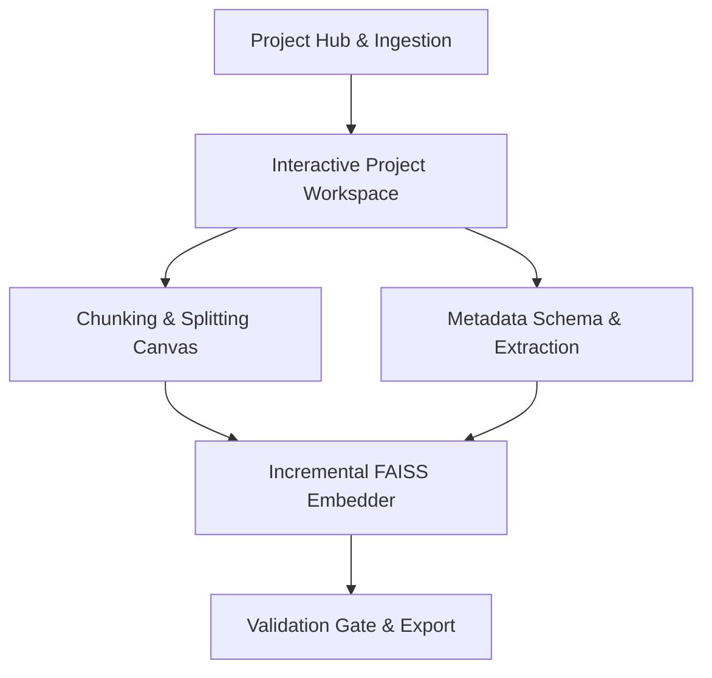

## Architecture Overview

The **RAG Scheme Editor** is structured as a local-first application combining a Vue 3 single-page application with a local Python 3.11 FastAPI backend process. The backend acts as the sole domain authority, executing all structural document transformations, AI service calls, and database transactions, while the Vue frontend provides an interactive, reactive editing workbench.

Unlike traditional linear pipelines, the workflow is non-linear and bidirectional. Users can move fluidly back and forth between visual chunk splitting, CMS metadata schema design, automated extraction, and incremental embedding without resetting state or losing existing work.

### Communication & Data Flow
- **Client-to-Server RPC**: The frontend communicates with FastAPI over a local HTTP interface for discrete operations (splitting chunks, merging nodes, promoting headers, updating schema fields).
- **Real-Time Batch Streaming**: Long-running partition batches communicate progress, diagnostics, and failure states to the UI in real time.

FastAPI REST endpoints paired with Server-Sent Events (SSE) stream partitioned batch progress and error diagnostics directly to the client.

### Core System Lifecycle & Iterative Flow
1. **Project Hub & Ingestion**: Create or open a project from disk, configure local model connectivity (LM Studio), and import multi-format documents (DOCX, PDF, MD, TXT) mapped with persistent UUIDs.
2. **Bidirectional Chunk & Metadata Iteration**: Users freely oscillate between two interconnected activities:
   - **Visual Chunk Refinement**: Splitting, merging, promoting headers, or previewing semantic splits. Manual boundaries remain locked, and downstream indices adjust contiguously.
   - **CMS Metadata Design & Extraction**: Defining field models, triggering partitioned LLM extraction, and authoring manual metadata overrides.
3. **Granular Dirty Flagging**: Any backward navigation (e.g., splitting a chunk after metadata generation, or updating a parent header) non-destructively preserves unaffected data, flags only mutated nodes as `stale`, and schedules incremental re-processing.
4. **Incremental Embedding Refresh**: Contextual breadcrumbs are compiled and vectorized in discrete, checkpointed batches for stale/missing chunks only.
5. **Validation Gate & Export**: The system validates data completeness (blocking on empty chunks, missing/stale vectors, or schema violations) before compiling a sealed `.zip` bundle containing `db.faiss`, `dbmetadata.json`, and `metadatascheme.json`.

## Data Models & State

Project state is fully encapsulated in an embedded `.sqlite` database file located in the project directory. Application-wide preferences (such as default local model identifiers) reside in a root `config.json`.

### Core Relational Tables

- **`projects`**: Top-level project entity.
  - `id`: Primary key string.
  - `name`: Display name.
  - `llm_model`: Active model identifier for extraction.
  - `embedding_model`: Active model identifier for embeddings.
  - `created_at`, `updated_at`: Timestamps.

- **`documents`**: Tracked source assets within a project.
  - `id`: Immutable UUIDv4 string.
  - `project_id`: Foreign key referencing `projects.id`.
  - `filename`: Original file name.
  - `file_type`: Format descriptor (`docx`, `pdf`, `md`, `txt`).
  - `order_index`: Integer indicating visual document sequence.

- **`nodes`**: The structural backbone representing both headers and text chunks.
  - `id`: Immutable UUIDv4 string.
  - `document_id`: Foreign key referencing `documents.id`.
  - `parent_id`: Nullable UUIDv4 referencing parent `nodes.id` (or root document).
  - `node_type`: Node discriminator (`header` or `paragraph`).
  - `text_content`: Raw text string.
  - `order_index`: Scoped integer sequence within the document.
  - `embedding_status`: Status enum (`current`, `stale`, `missing`).
  - `embedding_blob`: Nullable raw binary vector data.

- **`schema_fields`**: CMS metadata attributes defining the extraction contract.
  - `id`: Immutable UUIDv4 string.
  - `project_id`: Foreign key referencing `projects.id`.
  - `field_slug`: Normalized field identifier used in JSON Schemas.
  - `field_label`: Human-readable display label.
  - `field_type`: Primitive or collection type (`string`, `number`, `boolean`, `array[string]`, `array[number]`, `date`).
  - `description`: Prompt instruction provided to the LLM.
  - `is_required`: Boolean toggle.
  - `order_index`: Integer display order.

- **`node_metadata`**: Concrete metadata field attachments per chunk.
  - `id`: Primary key integer.
  - `node_id`: Foreign key referencing `nodes.id`.
  - `field_id`: Foreign key referencing `schema_fields.id`.
  - `field_value`: Serialized JSON value.
  - `user_edited`: Boolean flag protecting manual corrections from LLM overwrites.

- **`batch_checkpoints`**: Partition recovery journal for resilient processing.
  - `id`: Primary key integer.
  - `job_type`: Job discriminator (`metadata` or `embedding`).
  - `completed_partition`: Highest partition index committed.
  - `total_partitions`: Total partitions in the current run.
  - `status`: Execution state (`in_progress`, `failed`, `completed`).
  - `last_error`: Text diagnostic message if aborted.

### Embedding Persistence Pattern

Dense vector embeddings are stored directly as raw float32 binary BLOBs inside the SQLite nodes table, keeping derived vector data bound to chunk lifecycle transactions.

### Non-Linear State Integrity & Cascading Rules
- **Metadata Preservation on Split/Merge**: When switching back to chunking after metadata has been generated, splitting a chunk retains existing metadata on the upper slice while the new child chunk inherits non-unique metadata and flags `embedding_status = 'missing'`. Merging adjacent chunks retains the lead chunk's UUID, deduplicates list attributes, and preserves identical scalar values.
- **Field Decoupling via Field UUIDs**: Modifying schema labels or slugs does not break existing chunk associations in `node_metadata` because values bind strictly to immutable `schema_fields.id` UUIDs.
- **Header Mutation Cascade**: Modifying a header's text or moving its hierarchy position sets `embedding_status = 'stale'` on all descendant chunks linked transitively via `parent_id` without discarding existing metadata.
- **Model Invalidation**: Changing `projects.embedding_model` triggers a global transition setting `embedding_status = 'stale'` across all chunks in the project and invalidates the cached FAISS index, while leaving text hierarchies and metadata untouched.

## Component Breakdown

### Frontend Components (Vue 3 / TypeScript)

- **Project Hub & Router**: Manages recent project histories, initial model configurations, and non-destructive bidirectional navigation across ingestion, chunking, schema design, and export phases without resetting active views.
- **Tiptap Visual Chunk Canvas**: Mounts custom ProseMirror Node Views for headers and visual chunk blocks. Intercepts split commands, drag-and-drop hierarchy restructuring, and inline text selection for header extraction.
- **CMS Schema Designer**: Visual collection builder allowing users to create, configure, and reorder metadata fields while tracking fields by immutable UUIDs, accessible before, during, or after chunk editing.
- **Batch Progress Modal**: Listens to backend Server-Sent Events, displaying real-time partition status, chunk counters, failure diagnostic badges, and one-click resumption triggers.
- **Pinia Workspace Store**: Caches active document trees, tracks dirty chunk states, coordinates selection sets, and synchronizes authoritative state bidirectionally with the backend API.

### Backend Modules (Python 3.11 / FastAPI)

- **Document Ingestion Engine**: Uses `python-docx` to walk heading hierarchies and paragraphs for Word documents; falls back to deterministic text-splitting parsers for Markdown, PDF, and plain text files.
- **Hierarchy & Ordering Manager**: Orchestrates UUIDv4 generation, re-parents descendant nodes upon structural demotion/promotion, shifts `order_index` sequences within atomic SQLite transactions, and handles metadata migration during chunk splits and merges.
- **Semantic Auto-Split Engine**: Wraps LangChain semantic splitters to calculate proposed break points based on embedding distance shifts, delivering isolated proposals to the UI for human review without mutating authoritative chunk state.
- **Partitioned Metadata Extractor**: Converts `schema_fields` into dynamic Pydantic models, partitions chunks into batches, dispatches structured completions via the OpenAI SDK to LM Studio, protects `user_edited: true` fields, and commits per-batch transactions.
- **Incremental FAISS Embedding Engine**: Traverses `parent_id` links to construct contextual payloads (`Title > Header > Subheader > Chunk`), vectors chunks in discrete batches, writes binary vectors to SQLite, and serializes `db.faiss`.
- **Validation Gate & Exporter**: Evaluates completeness invariants (rejecting empty chunks, stale/missing embeddings, and schema violations), guides users directly to offending nodes for quick remediation, and packages the final `.zip` RAG distribution archive.