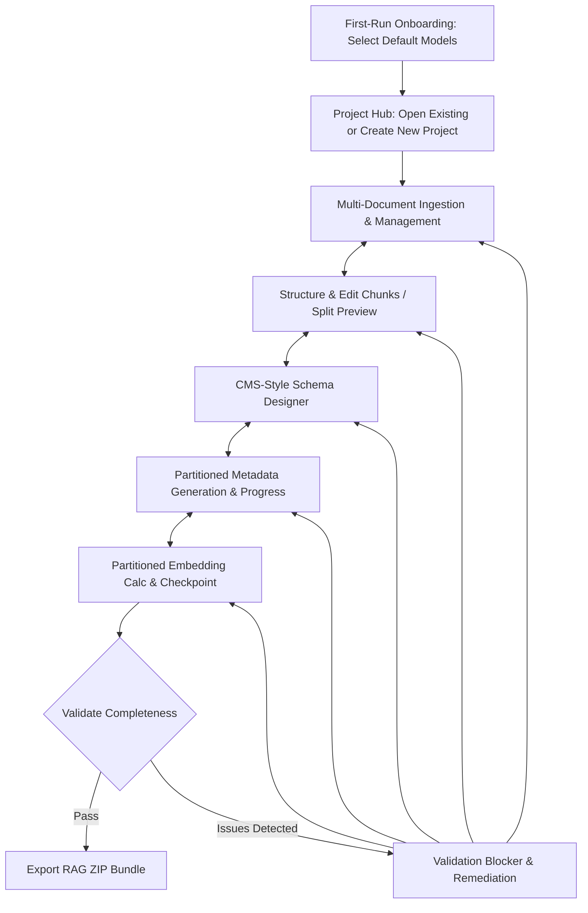

# Problem & Audience

### The Problem
Dataset preparation represents the single largest bottleneck and time sink in building and maintaining production RAG systems (often consuming over 70–80% of total engineering and curation effort). Despite being an ongoing, iterative process, existing tooling forces teams into a high-friction, all-or-nothing workflow:

- **Massive Time Loss on Minor Tweaks:** In current script-and-document workflows, changing a single chunk boundary, fixing a typo, or refining a metadata prompt forces developers to re-run entire extraction and embedding pipelines from scratch or manually stitch updated JSON files together.
- **Disproportionate Iteration Cost:** Because dataset prep is repeated frequently—across ongoing document updates, schema iterations, and retrieval tuning—the lack of incremental updates compounds into dozens of wasted hours per week.
- **Manual text formatting:** Authoring documents in Microsoft Word or Markdown and manually inserting arbitrary delimiters like `---` to force chunk boundaries.
- **Loss of structural context:** Flattening documents into isolated text snippets strips away valuable document hierarchies (titles, headers, and subheaders), causing silent retrieval failures in downstream RAG applications.
- **Disconnected metadata extraction:** Manually writing metadata tags or writing custom ad-hoc Python scripts to call LLMs, with no visual way to inspect, validate, or incrementally correct the output.
- **Fragile automated overwrites:** Running automated re-chunkers or LLM extraction wipes out manual human adjustments, forcing curators to redo past corrections.

### The Target Audience
- **AI Engineers & Knowledge Base Curators:** Practitioners tasked with frequently building, testing, and updating vector databases who lose hours waiting on full-corpus regeneration scripts for trivial dataset tweaks.
- **Domain Experts & Technical Writers:** Subject matter experts who understand document semantics and need an intuitive visual workbench to guide chunking, verify metadata, and make fast micro-edits without programming.
- **Local-First AI Teams:** Organizations requiring high-frequency dataset updates with local privacy (e.g., via LM Studio) without recurring cloud compute costs or data leakage.

### The Solution
The **RAG Scheme Editor** is a local-first visual workbench designed specifically to eliminate the dataset preparation bottleneck. By combining visual hierarchy editing, granular metadata extraction, and incremental embedding updates, it turns hours of repetitive batch scripting into fast, non-destructive, minute-by-minute visual iterations.

---

# Core Principles

### 1. The User is the Ultimate Authority
Automated systems (semantic chunkers, LLMs, heuristic splitters) are assistants, never final authorities. Any explicit user decision—such as manually splitting a chunk, merging sections, or correcting an extracted metadata field—must be locked as authoritative state. Automated actions may refine user-defined structures (e.g., splitting a large manual chunk into smaller semantic sub-chunks), but must **never destroy, merge across, or overwrite explicit human decisions**.

### 2. Granular, Incremental Updates Over Full Regeneration
Dataset refinement is continuous and iterative. A minor tweak to a single chunk, header, or prompt must never incur the penalty of rebuilding the entire dataset. The system tracks state at the individual chunk and field level so that only mutated nodes are flagged as `stale` and re-processed, drastically slashing preparation and maintenance time.

### 3. Structured State Over Arbitrary Delimiters
Chunk boundaries, document hierarchies, and metadata attachments are managed as formal, reactive application entities backed by **randomly generated UUIDs (UUIDv4)**. Every header, subheader, and chunk is assigned an immutable UUID upon creation, ensuring true persistence across edits, document re-orderings, and session reloads. The application completely eliminates reliance on fragile text markers (such as `---` or `<!-- chunk -->`), preventing parsing bugs and corrupted document layouts.

### 4. Structural Hierarchy as Semantic Context
A document is not a flat list of strings. Headers and subheaders provide critical contextual meaning to the paragraphs beneath them. Rather than forcing users to repeat titles inside every chunk body, the application preserves the explicit hierarchy (`Document > Header > Subheader > Chunk`). When embeddings are calculated, this structural breadcrumb trail is injected into the embedding payload while keeping the raw chunk text clean.

### 5. Deterministic Separation of Authoritative and Derived Data
The application strictly partitions state into three categories:
- **Authoritative User State:** Document structure, manual boundaries, schema definitions, and human-edited metadata.
- **Generated State:** LLM-suggested metadata fields and semantic split proposals.
- **Derived Data:** Contextualized embedding vectors, FAISS indexes, and cache files that can be regenerated on demand.

When authoritative text or headers change, only the affected derived data is flagged as `stale`, giving users full visibility and targeted control over re-computation.

---

# Key Features

### 1. Hierarchical Document Importer & Multi-Document Workspace
Imports raw documents and translates them into structured hierarchies containing documents, sections, headers, subheaders, and chunks.
- **Format Support:** Full structural parsing for DOCX (preserving heading levels and paragraph flows), with text-based fallback parsers for PDF, Markdown, and plain TXT.
- **UUID Entity Tagging & Explicit Hierarchy / Order Tracking:** Instantiates all imported documents, sections, headers, and initial chunk nodes with randomly generated UUIDv4 strings to anchor state permanently. Every node record stores an explicit `parent_id` linking chunks to their immediate header/subheader (and top-level headers to their root document or section) along with a deterministic `order_index` scoped per document to establish unambiguous sequence flows among sibling nodes.
- **Dynamic Corpus Management:** Multi-document project workspace allowing users to add, remove, and reorder source documents at any stage. Adding a new document assigns it a unique UUID, initializes `parent_id` links and sequential `order_index` values for its nodes, and enables incremental metadata extraction and embedding generation without affecting previously embedded documents.
- **Explicit Node Typings:** Tags every imported element with explicit node definitions (`header`, `paragraph`), mapping the structural skeleton of the document.

### 2. Tiptap-Powered Visual Hierarchy & Chunk Editor
A rich visual editing canvas built on Tiptap that renders structural document nodes rather than raw text.
- **Visual Chunk Containers:** Chunks appear as distinct UI blocks under their respective header and subheader nodes, ordered strictly by their document `order_index` and associated through direct `parent_id` bindings.
- **Node Style & Type Switching:** Every node contains an explicit type definition (`paragraph` vs. `header`). Users can select any node and switch its style on the fly (e.g., demoting a header to a paragraph or promoting a paragraph to a header) while dynamically re-parenting child containers and preserving document `order_index` positions.
- **Inline Selection to Header Extraction:** Users can select any substring within a chunk and convert it into a header. The selected text immediately detaches ("becomes loose") from the parent chunk, creating a new structural header entity with a fresh UUID, re-linking succeeding chunks under its new `parent_id`, and partitioning the surrounding chunk content with updated sequential `order_index` values.
- **Manual Boundary Controls:** One-click actions to split chunks at cursor positions (the upper chunk retains the original UUID, `parent_id`, and position, while the newly created child slice receives a fresh random UUIDv4, the same `parent_id`, and the next `order_index`, shifting downstream nodes) or merge adjacent chunks (the top/first chunk retains its UUID, `parent_id`, and `order_index` while metadata from both chunks is combined and deduplicated).
- **Multi-Chunk Selection:** Select arbitrary subsets of chunks across documents to trigger targeted batch operations without affecting the rest of the corpus.

### 3. Human-in-the-Loop Semantic Auto-Splitting
Integrates LangChain semantic splitting algorithms to automatically segment long text based on embedding distance or semantic shifts, with strict user verification.
- **Invariant Boundaries:** Semantic splitting operates strictly inside user-selected chunks and never bridges across user-defined chunk boundaries.
- **Interactive Split Preview & Accept/Reject:** When semantic splitting is triggered, proposed split boundaries are rendered as pending visual proposals. Users can review, adjust, accept, or reject the proposed splits before changes, child UUID allocations, `parent_id` bindings, and `order_index` recomputations become authoritative.
- **UUID Preservation & Allocation:** Upon acceptance, the primary top slice preserves the existing UUID, parent link (`parent_id`), and leading `order_index`, while newly created child chunks receive fresh random UUIDv4 identifiers, inherit the same `parent_id`, and receive consecutive `order_index` values within the document flow.

### 4. CMS-Style Metadata Schema Designer & Partitioned LLM Generation
Allows users to visually architect structured metadata models using an interface modeled after headless CMS database collection/content-type builders, generating metadata reliably using local or remote LLMs.
- **CMS-Inspired Collection Builder UI:** Visual schema canvas reminiscent of CMS database builders (e.g., Strapi, Directus). Users construct their metadata model using a visual field palette featuring explicit field cards, type icons, field slugs/keys, human-readable labels, extraction instructions/descriptions, and required toggles.
- **UUID-Tracked Schema Fields:** Each schema field definition is assigned an immutable UUIDv4 upon creation, decoupling physical field tracking from field names or display order. Renaming, reordering, or re-labeling fields dynamically maintains existing chunk bindings in SQLite without data corruption.
- **Supported Field Types:** Rich primitive and collection field types (`string`, `number`, `boolean`, `array[string]`, `array[number]`, `date`) that compile directly into a strict JSON Schema payload for structured LLM output.
- **Chunked Batch Processing & Error Trapping:** Metadata generation processes chunks in partitioned batches (e.g., parts of $N$ chunks). The system actively traps runtime exceptions including Out of Memory (OOM) crashes, network/endpoint timeouts, and malformed JSON output.
- **Resumable Checkpointed Execution:** Results from each batch partition are immediately committed to SQLite upon successful completion. If part 1 succeeds and part 2 fails (due to a timeout or OOM), part 1 remains saved in the database; the user can resolve the issue and resume generation directly from part 2 forward without starting over.
- **Real-Time Progress Dashboard:** Live progress modal displaying current batch progress, completed versus remaining chunk counts, per-chunk extraction status, and clear diagnostic badges for failed items.
- **Non-Destructive Field Protection & Force Override:** LLM-generated values never overwrite fields tagged with `user_edited: true` unless an explicit "Force Regenerate" option is toggled.

### 5. Incremental Local Embedding Engine with Partitioned Resumption & Stale Tracking
Generates dense vector embeddings using local or external embedding endpoints with zero-redundancy caching and fault-tolerant batching.
- **LM Studio Integration:** Native support for local LM Studio embedding endpoints out of the box, with extensible support for OpenAI-compatible APIs.
- **Contextual Embedding Payloads:** Combines `Doc Title + Header + Subheader + Chunk Body` into the embedding input for superior retrieval relevance, resolved efficiently by traversing each chunk's `parent_id` hierarchy.
- **Partitioned Batch Execution & Checkpointing:** Embeddings are computed in discrete sequential parts. Each part is committed to SQLite and temporary vector caches upon completion. If an OOM or timeout occurs in an intermediate batch, users can resume execution from the failed batch onwards.
- **Granular Stale Vector Detection:** Automatically marks only modified chunk vectors as `stale` when text, node styles, parent headers (queried directly via `parent_id`), or structural order change. Newly added documents have embeddings generated incrementally without recalculating existing documents.
- **Model Switch Warning:** Changing the project embedding model when embeddings already exist triggers a prominent user warning notifying them that all existing embeddings must be regenerated.

### 6. Standardized RAG Scheme Bundle Exporter & Validation Gate
Validates project completeness and packages all artifacts into an export bundle.
- **Concrete Export Validation Function:** A rigorous validation engine blocks export until all project data is concrete (no empty chunks, no stale or missing embeddings, and all chunk metadata conforms strictly to the active schema).
- **FAISS Vector Index (`db.faiss`):** Serialized vector index containing all valid chunk embeddings aligned with chunk UUIDs.
- **Chunk & Metadata Store (`dbmetadata.json`):** Deterministic mapping linking FAISS vector positions to chunk UUIDs, document `order_index`, raw text, parent hierarchy paths (resolved via `parent_id`), and combined metadata attributes.
- **Self-Describing Schema (`metadatascheme.json`):** The exact JSON Schema used to generate the dataset.

---

# User Actions & Flows

### Core Lifecycle Flow



---

### 0. First-Run Onboarding & Application Project Hub
- **First-Run Onboarding:** On first launch, the user configures local AI provider connectivity (e.g., LM Studio endpoints) and sets system-wide defaults for `default_llm_model` and `default_embedding_model`.
- **Project Hub:** Users can open an existing project directory from disk, create a new project, or close the currently active project to return to the hub. When closing a project, all authoritative states, dirty flags, and UUID maps are committed and persisted to the project's embedded SQLite database file (`.sqlite`).

### 1. Project Initialization & Dynamic Multi-Document Ingestion
- **Project Setup & Model Selection:** Creating a project initializes project-specific LLM and embedding model assignments inherited from global defaults, which can be modified at any time.
- **Bidirectional Step Navigation:** Users can freely navigate back and forth between any steps (Document Ingestion, Chunking, Schema, Metadata, Embedding, Export) without resetting progress or losing state.
- **Adding Additional Documents Mid-Project:** Users can upload new documents (DOCX, PDF, MD, TXT) at any time, even after schemas, metadata, and embeddings have already been generated for other documents.
  - Each newly imported document and its child nodes receive distinct UUIDv4 identifiers.
  - Every node entity stores an explicit `parent_id` establishing its hierarchy link (chunks point to their parent header/subheader; root headers point to the document entity).
  - Node positions are assigned contiguous `order_index` values scoped to the imported document.
  - Existing documents and their embeddings remain intact and unaffected.
- **Document Removal & Reordering:** Removing a document cleans up its corresponding chunk entries and flags derived index structures for update; reordering updates document index sequences while preserving chunk UUIDs, `parent_id` links, and internal node `order_index` sequences.

### 2. Visual Chunk Refinement, Splits, Merges & Semantic Auto-Split Review
- **Node Definition & Style Toggling:** Users toggle node styles between paragraph and header. Promoting a chunk to a header detaches it into a structural hierarchy node, creates subsequent child chunk containers, and dynamically updates the `parent_id` of subsequent chunks to reference the promoted header while preserving order via `order_index`.
- **Inline Selection to Header Split:** Highlighting text inside a chunk and clicking **Make Header** detaches the text into a standalone header with a new UUID and parent link, splitting remaining content into preceding and succeeding chunks with adjusted consecutive `order_index` values and updated `parent_id` references.
- **Manual Split Rules:** Splitting a chunk at a cursor position divides it into two segments: the top/upper slice preserves the existing UUID, existing metadata, `parent_id`, and original `order_index`, while the newly created slice receives a fresh random UUIDv4, the same `parent_id`, and an incremented `order_index` (shifting subsequent node indices across the document).
- **Merge Rules & Metadata Combination:** When adjacent chunks are merged, the top/first chunk's UUID, `parent_id`, and `order_index` are retained. Downstream nodes have their `order_index` decremented to maintain dense continuity. Metadata fields from both chunks are combined: identical scalar values are preserved, conflicting values are flagged for review, and list/array fields are merged and deduplicated.
- **Semantic Auto-Splitting with Accept/Reject Gate:**
  - The user selects one or more large chunks and triggers **Semantic Split**.
  - LangChain semantic splitters evaluate split points, and the UI presents an interactive **Split Preview** showing candidate boundaries.
  - The user explicitly reviews the proposed splits and clicks **Accept** to apply the boundaries (allocating fresh UUIDs to new slices, retaining `parent_id`, and recomputing `order_index` sequences per document) or **Reject** to discard suggestions and keep the existing chunk intact.

### 3. CMS-Style Metadata Schema Configuration & Resumable Extraction
- **CMS-Style Schema Builder:** Users design metadata templates using a visual builder modeled after headless CMS content-type editors. Users click "Add Field" from a palette of types (`Text`, `Number`, `Boolean`, `Tags / Array`, `Date`), configuring field keys, labels, validation rules, and LLM prompting instructions on each field card.
- **UUID-Tracked Schema Items:** Each field added in the Schema Designer receives an immutable UUIDv4. If a field name is changed (e.g., `topic` to `subject_area`), the system uses the field's UUID to update existing chunk metadata records in SQLite seamlessly without data loss.
- **Partitioned Batch Extraction:** When triggering extraction (across all documents, a single document, or selected chunks), the backend divides the operation into sequential partitions/parts.
- **Progress Tracking & Error Trapping:** A progress modal displays real-time execution across chunks (e.g., "Processing Part 2 of 5 — Chunk 45/100"). If a local model crashes with an Out of Memory (OOM) error, times out, or produces invalid JSON, the runner traps the error, highlights the failing chunk/part, and preserves all data completed in preceding parts.
- **Resume from Failure Point:** When a partition fails, the user can adjust context settings or retry the request; clicking **Resume Extraction** continues execution starting precisely from the failed partition forward, avoiding wasted redundant LLM calls.
- **Inspection & Manual Correction:** Editing a field in the chunk side panel sets `field.user_edited = true`.
- **Non-Destructive Prompt Tweaking & Force Toggle:** Prompt updates re-run generation across unedited fields (`user_edited == false`). Toggling **Force Overwrite** forces replacement of all fields and resets `user_edited` to `false`.

### 4. Incremental Embedding Refresh, Partitioned Execution & Alerts
- **Partitioned Refresh of Stale Embeddings:** When chunks are added or modified, users click **Refresh Stale Embeddings**. Chunks requiring calculation (`embedding_status != 'current'`) are partitioned into batch parts.
- **Progress & Failure Checkpointing:** The embedding pipeline reports live progress. If LM Studio hits an OOM or request timeout midway through processing, previously completed batches remain safely committed to SQLite and index caches. The user can resume calculations from the failed partition.
- **Embedding Model Switch Notification:** If a user navigates to project settings and modifies the embedding model after embeddings have already been generated, a warning modal alerts the user: *"Changing the embedding model invalidates all existing vector embeddings. All chunks in the project will need to be regenerated. Do you want to proceed?"* If confirmed, all chunks transition to `stale`.

### 5. Validation Function & RAG Scheme Bundle Export
- **Pre-Export Validation Function:** Clicking **Export RAG Scheme** executes a strict project validation check. The export is blocked if any information is not concrete, specifically:
  1. Any chunk contains empty or whitespace-only text.
  2. Any chunk has an ungenerated (`missing`) or `stale` embedding vector.
  3. Any chunk metadata violates the active JSON Schema (missing required fields or type mismatches).
- **Remediation Navigation:** If validation fails, the UI displays the concrete blocker list with direct one-click links to offending chunks and an option to "Generate All Missing/Stale Embeddings".
- **Export Generation:** Once validation passes cleanly, the system builds `db.faiss`, `dbmetadata.json` (indexed by chunk UUIDs with parent hierarchy paths traversed via `parent_id` and sequenced by document `order_index`), and `metadatascheme.json`, packaging them into `<project-name>.zip`.

---

# Data & Tech Constraints

### Technical Stack

- **Frontend:** Vue 3, Vite, TypeScript, SCSS, Pinia.
- **Rich Text Engine:** Tiptap / ProseMirror with custom Node Views for Headers, Subheaders, and Chunk Containers with explicit node definition schemas (`type: 'header' | 'paragraph'`).
- **Backend:** Python 3.11+, FastAPI, Uvicorn, SQLite (`sqlite3`), LangChain (for semantic splitters), FAISS (`faiss-cpu`), Pydantic v2, standard library `uuid`.
- **Local AI Provider:** LM Studio API (OpenAI-compatible endpoints for `/v1/chat/completions` and `/v1/embeddings`).

### Persistence & Storage Architecture

Project state is stored in a single embedded `.sqlite` database file (holding project-level model configurations, metadata schemas with field UUIDs, dirty/stale flags, batch execution checkpoints, and UUID-keyed chunk states) alongside raw imported asset files. Document hierarchies, metadata, and chunk states are stored relationally with foreign keys (`parent_id` referencing parent node or document UUID, and an explicit `order_index` column on nodes), providing transactional rollback support and checkpointed batch recovery. Global application settings (default LLM and embedding model preferences, recent project paths) are stored in an application-level `config.json`.

### Data Synchronization & Integrity Rules

- **Model Configuration & Model Switch Invariant:**
  - Global defaults for `default_llm_model` and `default_embedding_model` are saved in `config.json`.
  - Each project stores its own `llm_model` and `embedding_model` within the project's `.sqlite` database file.
  - If the project's `embedding_model` is altered when chunk embeddings already exist, the backend raises a confirmation requirement. Upon user confirmation, all chunk embedding statuses across all documents transition to `stale`, and the cached FAISS index is marked invalid.
- **Backend as Domain Authority:** While Tiptap manages client-side cursor interactions, all structural chunk mutations, schema evaluations, semantic splitting proposals, node sequence re-indexing, hierarchy parent updates (`parent_id`), and vector operations are validated and executed by the FastAPI backend.
- **Document and Node UUID Persistence Invariant:**
  - Every document entity is assigned an immutable random UUIDv4 string (e.g., `doc_6f2e4c2b-8a1e-4c2d-9e3f-1a2b3c4d5e6f`).
  - Every structural header and chunk entity is assigned an immutable random UUIDv4 string (e.g., `chunk_9b1deb4d-3b7d-4bad-9bdd-2b0d7b3dcb6d`).
  - Additional documents can be added at any time; newly added documents receive fresh UUIDs and do not invalidate existing document structures or valid embeddings.
- **Node Parent & Hierarchy Association Invariant:**
  - Every node entity stores an explicit `parent_id` (UUIDv4) establishing its hierarchical parent:
    - Chunk nodes (`paragraph`) point to their parent subheader or header UUID.
    - Subheaders point to their parent header UUID.
    - Top-level headers point to their root `document_id` (or section UUID).
  - When a header is modified, all chunk nodes linked via `parent_id` (directly or transitively) are directly identified and transitioned to `stale` for vector recomputation.
- **Node Order Index & Document Sequence Invariant:**
  - Every node entity (headers, subheaders, chunks/paragraphs) maintains an explicit `order_index` (integer sequence scoped per `document_id`).
  - When multiple sibling chunks point to the same `parent_id`, `order_index` deterministically dictates their visual order and reading flow.
  - Any structural mutation (splitting, merging, inline header creation, or auto-splitting) recalculates or shifts `order_index` values across the document to maintain continuous sequence integrity.
- **UUID-Tracked Schema Field Invariant:**
  - Every metadata field definition in the schema maintains an immutable `field_id` (UUIDv4).
  - Chunk metadata values are mapped internally by `field_id`. Field renames or descriptions modify the schema definition without severing data bindings in existing chunks. If a `field_id` is removed from the schema, the corresponding chunk metadata values are flagged for removal or archived.
- **Partitioned Batch Execution & Transactional Checkpoint Invariant:**
  - LLM metadata extraction and embedding calculation across chunk sets are partitioned into sequential parts of configurable batch sizes.
  - Each successful batch partition commits its chunk updates to SQLite in an explicit transaction immediately upon completion.
  - In the event of an Out of Memory (OOM) error, network timeout, or server disconnection, the active batch partition is rolled back, the failure is trapped with diagnostic details, and all previously completed batch transactions remain committed.
  - Resuming a failed batch operation starts exclusively from the failed partition forward (`WHERE embedding_status != 'current'` or `WHERE metadata_status != 'current'`), preventing redundant recalculation of successful parts.
- **Splitting & Merging Rules:**
  - **Chunk Split:** When a chunk is split (manually or via accepted semantic split), the upper/first slice retains the original chunk UUID, its existing metadata, `parent_id`, and original `order_index`. The newly created slice receives a fresh random UUIDv4, the same `parent_id`, `order_index = original_index + 1`, and inherits non-unique metadata or is initialized with `embedding_status: 'missing'`. Subsequent nodes within the document have their `order_index` incremented.
  - **Chunk Merge:** When two chunks are merged, the top/first chunk's UUID, `parent_id`, and `order_index` are retained. Downstream nodes have their `order_index` decremented to maintain dense continuity. Metadata fields from both chunks are combined: identical values are preserved, and array/list fields are combined and deduplicated. Conflicting scalar values retain the top chunk's value unless user-corrected.
- **Human-in-the-Loop Semantic Split Invariant:**
  - LangChain semantic split computations output candidate boundaries as transient proposals.
  - Proposed child chunks, UUIDs, `parent_id` associations, and proposed `order_index` allocations are not committed to authoritative project state until the user triggers an explicit `accept` action. A `reject` action clears the proposal without mutating chunk boundaries.
- **Granular Dirty & Stale State Tracking:**
  - Chunks maintain `embedding_status: 'current' | 'stale' | 'missing'`.
  - Modifying chunk text, updating parent headers (tracked via `parent_id`), changing node types, reordering nodes, or switching the embedding model transitions affected chunks to `stale`.
  - When a new document is added, its chunks are initialized with `missing`. Refreshing embeddings runs exclusively on chunks `WHERE embedding_status != 'current'`.
- **Field-Level Protection & Merge Invariant:**
  - Metadata field structure:
    ```json
    {
      "field_id": "uuidv4-string",
      "value": "Extracted or user-authored value",
      "user_edited": true
    }
    ```
  - When `force_overwrite = false`, LLM metadata extraction merges only into fields where `user_edited == false`.
  - When `force_overwrite = true`, LLM metadata extraction overwrites all fields and resets `user_edited` to `false`.
- **Contextual Embedding Invariant:**
  - Embedding payload dispatched to LM Studio:
    `{document_title}\n\n## {header_title}\n### {subheader_title}\n\n{chunk_text}`.
  - Hierarchy breadcrumbs are constructed by traversing `parent_id` pointers up to the document root.
- **Concrete Export Validation Gate:**
  - The export pipeline invokes an explicit `validate_project()` function and strictly blocks bundle export if:
    1. Any chunk contains empty or whitespace-only text.
    2. Any chunk has `embedding_status != 'current'` (i.e., `missing` or `stale`).
    3. Any chunk metadata violates the active schema definitions or contains unhandled merge conflicts.