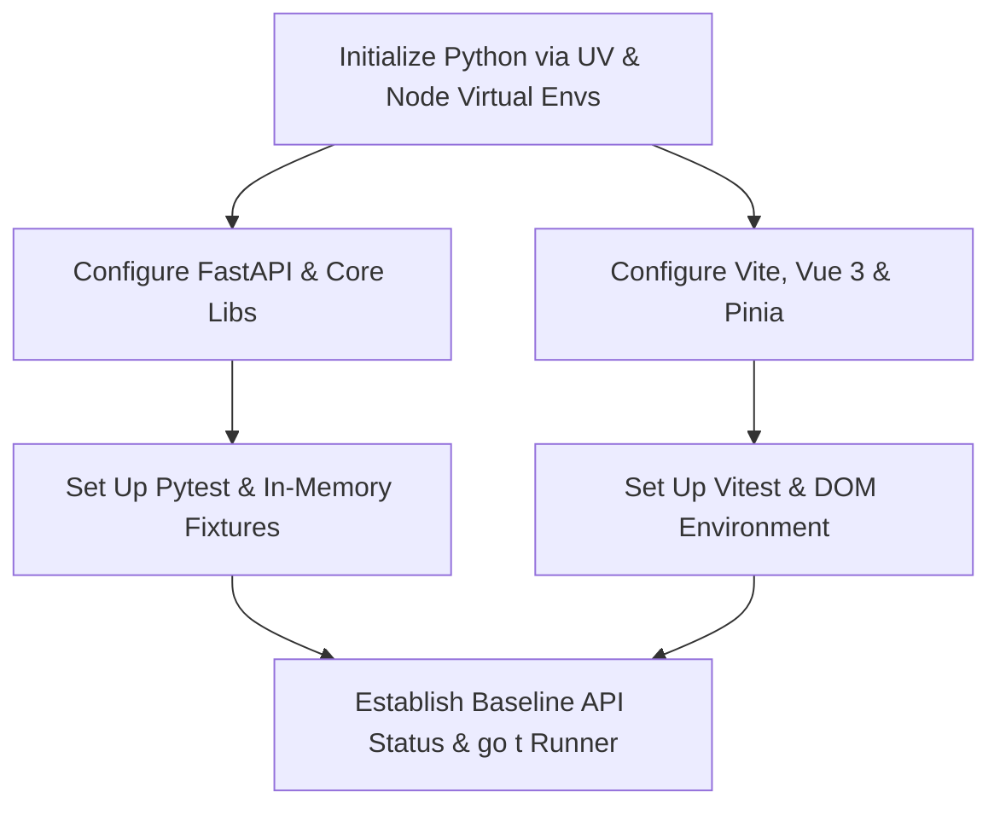

## Environment Setup

**Goal:** Establish a functional local development environment with verified communication between the Vue 3 frontend and the FastAPI backend, along with configured automated test runners using UV for ultra-fast Python package management.

- [x] **Backend Environment Setup (UV-Powered):**
  - [x] Initialize Python 3.11+ project and virtual environment via UV (`uv venv --python 3.11`).
  - [x] Configure `pyproject.toml` and install core backend dependencies using `uv add`: `fastapi`, `uvicorn`, `pydantic>=2.0`, `openai`, `faiss-cpu`, `langchain-text-splitters`, `python-docx`, `pytest`, `httpx`.
  - [x] Create global application config file `config.json` storing `default_llm_model`, `default_embedding_model`, and `lm_studio_endpoint` (defaulting to `http://localhost:1234/v1`).
  - [x] Implement baseline FastAPI application entry point with CORS middleware allowing local Vite dev requests.
  - [x] Implement health and provider status endpoint (`GET /api/status`) verifying local API liveness and checking connectivity to the LM Studio endpoint.
- [x] **Frontend Environment Setup:**
  - [x] Initialize Vite application with Vue 3, TypeScript, Pinia, and SCSS preprocessor.
  - [x] Install client dependencies: `@tiptap/vue-3`, `@tiptap/pm`, `@tiptap/starter-kit`, `lucide-vue-next`, `axios`.
  - [x] Centralized HTTP client configured with local base URL (`http://localhost:8000`).
  - [x] Configure SCSS design tokens (color variables, status indicators for `current`, `stale`, and `missing` states, font families, and modal layouts).
- [x] **Unit Testing & Test Runner Configuration:**
  - [x] Configure Pytest in `pytest.ini` with test discovery under `tests/backend/` and setup in-memory SQLite fixtures.
  - [x] Configure Vitest in `vitest.config.ts` with `happy-dom` environment for component and store testing under `tests/frontend/`.
  - [x] Create consolidated test execution script `go t` that triggers `uv run pytest` and `npm run test:unit` sequentially.
  - [x] Implement initial smoke tests in both suites to verify test runner operation.
- [x] **Testing Point 1: Verify Core Connection & Automated Test Runner**
  - [x] Start backend server via `uv run uvicorn main:app --reload` on port 8000.
  - [x] Start frontend server via `npm run dev` on port 5173.
  - [x] Verify the frontend successfully queries `/api/status` and displays the backend connectivity status.
  - [x] Execute `go t` and confirm both Pytest and Vitest runners execute cleanly with all baseline assertions passing.

## Database & Schema

**Goal:** Implement the embedded SQLite persistence layer and Pydantic domain models to manage projects, documents, hierarchical nodes, CMS metadata schemas, and partitioned batch checkpoints.

- [x] **SQLite Database Engine:**
  - [x] Implement embedded SQLite connection factory initializing a project-specific `.sqlite` file on disk whenever a project is created or loaded.
  - [x] Create relational schema migration script executing DDL for core tables:
    - [x] `projects`: `id`, `name`, `llm_model`, `embedding_model`, `created_at`, `updated_at`.
    - [x] `documents`: `id` (UUIDv4), `project_id`, `filename`, `file_type`, `order_index`, `created_at`.
    - [x] `nodes`: `id` (UUIDv4), `document_id`, `parent_id` (nullable UUIDv4), `node_type` (`header` | `paragraph`), `text_content`, `order_index`, `embedding_status` (`current` | `stale` | `missing`).
    - [x] `node_embeddings`: `node_id` (UUIDv4 foreign key), `embedding_blob` (float32 BLOB), `updated_at`.
    - [x] `schema_fields`: `id` (UUIDv4), `project_id`, `field_slug`, `field_label`, `field_type`, `description`, `is_required`, `order_index`.
    - [x] `node_metadata`: `id` (integer autoincrement), `node_id` (UUIDv4), `field_id` (UUIDv4), `field_value` (serialized JSON text), `user_edited` (boolean).
    - [x] `batch_checkpoints`: `id`, `job_type` (`metadata` | `embedding`), `completed_partition`, `total_partitions`, `status`, `last_error`, `updated_at`.
  - [x] Add indexes on `nodes(document_id, order_index)`, `nodes(parent_id)`, `node_metadata(node_id, field_id)`, and `schema_fields(project_id)`.
- [x] **Domain Models & Pydantic Validation:**
  - [x] Define strict Pydantic v2 schemas for all entities (`Project`, `Document`, `Node`, `SchemaField`, `NodeMetadata`, `BatchCheckpoint`).
  - [x] Implement dynamic JSON Schema generator function compiling active `schema_fields` records into a standard JSON Schema draft payload for structured LLM extraction.
- [x] **Hierarchy & Ordering Data Utilities:**
  - [x] Implement recursive CTE query resolving parent hierarchy breadcrumbs (`Doc Title > Header > Subheader > Chunk`) traversing `parent_id` up to the root with a `depth < 50` cycle prevention guard, terminating when `parent_id IS NULL`, and joining the `documents` table via `nodes.document_id` to retrieve and prepend the root document title.
  - [x] Implement application-level tree integrity validator ensuring hierarchy mutations are acyclic prior to committing parent updates.
  - [x] Implement transactional sequence shift utility guaranteeing contiguous, non-negative `order_index` sequences within a document upon insertions, splits, or deletions.
  - [x] Implement cascade logic setting `embedding_status = 'stale'` on descendant chunks whenever a header's text or parent link is updated.
- [x] **Unit Tests for Data Layer:**
  - [x] Write tests verifying UUID generation and persistence across SQLite transaction commits.
  - [x] Write tests verifying `order_index` densification during node insertions and deletions.
  - [x] Write tests verifying recursive CTE breadcrumb assembly with document title prepending, and cycle prevention depth termination under circular parent assignments.
  - [x] Write tests asserting that renaming or reordering `schema_fields` preserves chunk associations via immutable `field_id`.
  - [x] Execute `go t` to verify data layer tests pass.

## Document Ingestion & Hierarchy Management

**Goal:** Implement multi-document import pipelines and API endpoints that parse raw files into structured AST hierarchies linked by UUIDv4 identifiers, parent pointers, and order indices.

- [x] **Document Parsers:**
  - [x] Implement DOCX structural parser using `python-docx`:
    - [x] Walk paragraphs and headings, extracting heading levels (`Heading 1`, `Heading 2`, `Heading 3`).
    - [x] Map heading levels to hierarchical nodes with appropriate `parent_id` references.
    - [x] Group succeeding regular paragraphs as `paragraph` nodes linked to their immediate header's UUID.
  - [x] Implement fallback text parsers for Markdown (parsing `#` heading levels), plain text (`.txt`), and PDF fallback text.
  - [x] Assign deterministic sequential `order_index` values and immutable random UUIDv4 strings to all parsed document, header, and chunk entities.
- [x] **Ingestion Endpoints:**
  - [x] Implement `POST /api/projects/{id}/documents/upload` supporting multi-file uploads (DOCX, PDF, MD, TXT).
  - [x] Implement `GET /api/projects/{id}/documents` returning all imported documents with node counts and embedding readiness states.
  - [x] Implement `DELETE /api/projects/{id}/documents/{doc_id}` cleaning up associated nodes, embeddings, and metadata within an atomic transaction.
  - [x] Implement `PATCH /api/projects/{id}/documents/reorder` to adjust document sequences without altering internal node ordering.
- [x] **Hierarchy Mutation Operations:**
  - [x] Enforce acyclic verification guard across all parent pointer reassignments to prevent circular hierarchy references before committing.
  - [x] Implement `POST /api/projects/{id}/nodes/{node_id}/split`:
    - [x] Retain original UUID, `parent_id`, and `order_index` on the primary/upper slice.
    - [x] Allocate fresh UUIDv4, set `order_index = original + 1`, and inherit `parent_id` on the child slice.
    - [x] Atomically increment `order_index` for all downstream nodes in the document.
    - [x] Mark new child chunk with `embedding_status = 'missing'`.
  - [x] Implement `POST /api/projects/{id}/nodes/{node_id}/merge`:
    - [x] Merge specified chunk with its immediate successor.
    - [x] Retain leading chunk's UUID, `parent_id`, and `order_index`.
    - [x] Decrement downstream `order_index` values across the document.
    - [x] Combine metadata fields: keep identical scalar values, flag conflicting scalar values for review, merge and deduplicate list fields.
  - [x] Implement `POST /api/projects/{id}/nodes/{node_id}/promote`:
    - [x] Toggle node type from `paragraph` to `header`.
    - [x] Dynamically update `parent_id` of subsequent sibling chunks to reference the promoted header.
    - [x] Cascade `embedding_status = 'stale'` across all newly associated children.
  - [x] Implement `POST /api/projects/{id}/nodes/detach-selection`:
    - [x] Detach selected substring within a chunk into a brand new standalone header node.
    - [x] Split preceding and succeeding text into discrete chunks with recomputed consecutive `order_index` values.
- [x] **Unit Tests for Ingestion & Mutations:**
  - [x] Write unit tests verifying DOCX parsing yields correct nested parent-child relationships.
  - [x] Write tests asserting manual split rules maintain downstream index continuity.
  - [x] Write tests verifying merge rules combine metadata lists and flag scalar conflicts.
  - [x] Write tests asserting acyclic checks reject mutations creating circular parent references.
  - [x] Execute `go t` to verify ingestion test suite passes.

## Interactive Visual Canvas & Frontend Workspace

**Goal:** Construct the responsive Vue 3 user interface featuring the Project Hub, bidirectional multi-step navigation, and the Tiptap-powered visual hierarchy editor with complete, standalone manual chunking and styling capabilities.

*Sequencing Note: All manual boundary operations (cursor splits, double-enter hover splits, right-click splits, selection-to-header, and merges) in this section are designed to function independently without requiring AI/vector connectivity. Semantic auto-splitting is layered later in Section 6 as an optional AI-assisted accelerator.*

- [x] **Project Hub & Router Setup:**
  - [x] Implement Project Hub view with recent projects list, "Open Existing Project" directory picker, and "Create Project" modal.
  - [x] Implement global settings modal to set default LLM and embedding model endpoints (LM Studio).
  - [x] Implement bidirectional step navigator bar allowing users to switch freely between Ingestion, Chunk Canvas, Schema Designer, Metadata Extraction, Embedding Refresh, and Export without state loss.
- [x] **Pinia Workspace Store:**
  - [x] Implement `useWorkspaceStore` holding active project details, loaded document tree, active node selection, current workspace step, and dirty chunk tracking.
  - [x] Implement actions for optimistic UI updates during chunk splitting, merging, and type promotions, with server reconciliation on error.
  - [x] Track real-time dirty flags for modified chunks (`current`, `stale`, `missing`) in the background regardless of active step.
- [x] **Tiptap Custom Visual Hierarchy Canvas:**
  - [x] Implement core Tiptap editor wrapper configured with ProseMirror schema enforcing `header` and `paragraph` node types.
  - [x] Build custom Vue Node View for `HeaderNode`:
    - [x] Displays heading level indicator (H1, H2, H3).
    - [x] Inline style switcher to demote header to paragraph.
    - [x] Visual indicator showing count of child chunks linked to this header.
  - [x] Build custom Vue Node View for `ChunkContainerNode`:
    - [x] Distinct bordered container displaying scoped `order_index` badge.
    - [x] Step-aware embedding status indicator pill (`current` in green, `stale` in yellow, `missing` in red), reactively displayed exclusively during the Embedding Refresh step (hidden during Ingestion, Chunk Canvas, Schema Designer, and Metadata Extraction to minimize visual clutter).
    - [x] Double-enter hover split divider: detect double Enter within a chunk to produce an interactive break that displays a dotted horizontal line with a centered "Split" button on hover.
    - [x] Right-click context menu integration: custom context menu triggered on right-click within chunk body providing a "Split Chunk Here" action targeting the exact cursor position.
    - [x] Merge button to combine with adjacent node.
  - [x] Implement floating text selection toolbar:
    - [x] Appears upon text highlight inside any chunk.
    - [x] Includes "Make Header" button that calls `/api/projects/{id}/nodes/detach-selection` and replaces editor state with newly detached nodes.
    - [x] Other option is also to split the chunk here. then we split it from the start of selection
- [x] **Multi-Chunk Selection Toolbar:**
  - [x] Enable multi-chunk checkbox selection across document sections for batch operations (batch semantic split, batch regenerate metadata).
- [x] **Testing Point 2: Verify Visual Canvas & Manual Boundary Operations**
  - [x] Load imported document into Tiptap canvas.
  - [x] Perform chunk split via double-enter hover dotted line button and via right-click context menu; confirm upper slice keeps original ID while lower slice receives fresh UUID.
  - [x] Highlight text substring, trigger "Make Header", and verify detached header creates new hierarchy parent with updated child bindings.
  - [x] Verify that embedding status indicator pills remain hidden in Chunk Canvas step and become visible when switching to the Embedding Refresh step.
  - [x] Run `go t` to ensure frontend store and component unit tests pass cleanly.

## CMS Schema Designer & Metadata Extraction

**Goal:** Build the CMS-style collection builder interface and implement partitioned, fault-tolerant batch metadata extraction via local LM Studio completions.

- [ ] **CMS-Style Schema Designer UI:**
  - [ ] Build visual schema canvas with field palette supporting types: `string`, `number`, `boolean`, `array[string]`, `array[number]`, `date`.
  - [ ] Implement editable Field Card component displaying field label, auto-generated slug, type icon, required toggle, and prompt description textarea.
  - [ ] Ensure every field is bound to an immutable `field_id` (UUIDv4) so renames or reorders do not break existing chunk bindings.
  - [ ] Implement schema persistence endpoints (`GET/POST/PUT /api/projects/{id}/schema`).
- [ ] **Partitioned Batch Extraction Engine:**
  - [ ] Implement metadata batch partitioner dividing eligible chunks into configurable batches of N chunks (e.g., N=10) editing in config.
  - [ ] Implement LLM prompt builder transforming active `schema_fields` into a strict JSON Schema and assembling chunk context (`Document Title > Headers > Chunk Body`).
  - [ ] Implement OpenAI client wrapper targeting LM Studio `/v1/chat/completions` with `response_format: { type: "json_object" }`.
  - [ ] Implement transactional partition committer:
    - [ ] Commit each batch's extracted metadata into `node_metadata` within an atomic SQLite transaction upon completion.
    - [ ] Update `batch_checkpoints` recording `completed_partition` and `status`.
    - [ ] Protect fields with `user_edited: true` unless `force_overwrite` is explicitly enabled.
  - [ ] Implement error trapper catching timeouts, JSON decoding failures, and local OOM crashes, rolling back only the active batch and preserving previously committed batches.
- [ ] **Real-Time Progress Streaming (SSE):**
  - [ ] Implement job trigger endpoint `POST /api/projects/{id}/jobs/metadata/start` dispatching background extraction task.
  - [ ] Implement Server-Sent Events (SSE) endpoint `GET /api/projects/{id}/jobs/metadata/stream` pushing real-time partition completion events, chunk counters, and diagnostic error alerts.
  - [ ] Implement frontend Batch Progress Modal:
    - [ ] Displays live partition progress bar (e.g., "Processing Part 2 of 5 — Chunk 45/100").
    - [ ] Shows diagnostic failure cards on crash.
    - [ ] Includes "Resume Extraction" button that restarts execution starting from the first incomplete partition.
- [ ] **Chunk Metadata Inspector & Manual Override Panel:**
  - [ ] Build slide-out side panel displaying metadata fields for the active chunk.
  - [ ] Allow inline editing of field values; automatically tag edited fields with `user_edited = true`.
- [ ] **Unit Tests for Metadata Extraction:**
  - [ ] Test dynamic Pydantic schema generation from arbitrary field configurations.
  - [ ] Test that batch checkpoints allow resuming from failed partition without re-running completed partitions.
  - [ ] Test that LLM output does not overwrite fields with `user_edited: true` when `force_overwrite = false`.
  - [ ] Execute `go t` to verify test suite passes.

## Semantic Auto-Splitting & Incremental Embeddings

**Goal:** Implement LangChain-powered semantic splitting with user verification, and build the incremental, partitioned embedding pipeline with FAISS integration.

*Sequencing Note: Semantic auto-splitting is introduced here because it leverages LM Studio embedding distance evaluations. It acts as an enhancement on top of the already functional manual chunking canvas from Section 4.*

- [ ] **Semantic Auto-Splitting Engine:**
  - [ ] Integrate LangChain semantic splitters evaluated on embedding distance thresholds.
  - [ ] Implement `POST /api/projects/{id}/nodes/semantic-split-preview`:
    - [ ] Calculate candidate split boundaries strictly within selected chunk boundaries without mutating authoritative state.
    - [ ] Return candidate boundary positions, slices, and confidence scores to the UI.
  - [ ] Build In-Canvas Semantic Split Reviewer (replacing modal dialogs):
    - [ ] Inserts proposed split boundaries directly into the Tiptap canvas as a two-enter break featuring a dotted horizontal line across the gap.
    - [ ] Displays centered inline "Accept" and "Reject" action buttons along the dotted divider, doubling as a visual tutorial demonstrating manual double-enter splitting.
    - [ ] Provides an "Accept All" action in the selection toolbar allowing users to batch-commit all proposed split boundaries without inspecting each one individually.
  - [ ] Implement `POST /api/projects/{id}/nodes/semantic-split-accept` supporting both single boundary acceptance and batch "Accept All":
    - [ ] Converts accepted boundaries into authoritative nodes: original slice retains UUID and `order_index`; new slices receive fresh UUIDv4s and incremented `order_index` values.
    - [ ] Adjusts downstream document `order_index` contiguity.
  - [ ] Implement candidate rejection handling that cleans up proposed inline break elements and restores unified chunk flow without mutating backend state.
- [ ] **Contextual Embedding Engine:**
  - [ ] Implement contextual payload compiler:
    - [ ] Resolves ancestor headers via recursive `parent_id` lookups.
    - [ ] Formats payload: `{document_title}\n\n## {header_title}\n### {subheader_title}\n\n{chunk_text}`.
  - [ ] Implement partitioned embedding execution:
    - [ ] Query target chunks `WHERE embedding_status != 'current'`.
    - [ ] Split targets into sequential parts.
    - [ ] Query LM Studio `/v1/embeddings` using the OpenAI SDK.
    - [ ] Store float32 binary vectors into `node_embeddings` and update `nodes.embedding_status = 'current'` per completed partition.
  - [ ] Implement FAISS CPU Index synchronizer:
    - [ ] Maintain synchronized FAISS Flat index (`faiss.IndexFlatIP` or `IndexFlatL2`).
    - [ ] Rebuild serialized index cache when all current embeddings are verified.
- [ ] **Model Switch Warning & Stale Cascading:**
  - [ ] Implement project settings check: if user changes `projects.embedding_model` when valid embeddings exist, prompt warning requiring explicit confirmation.
  - [ ] On confirmation, transition all chunks across all documents to `embedding_status = 'stale'` and invalidate FAISS cache.
- [ ] **Unit Tests for Semantic Splitting & Embeddings:**
  - [ ] Test that rejected semantic split proposals cleanly remove candidate inline dividers and leave chunk state unaltered.
  - [ ] Test that "Accept All" batch converts all candidate boundaries within the document/selection to authoritative chunks.
  - [ ] Test that modifying a parent header flags all child chunks as `stale`.
  - [ ] Test incremental embedding execution updates only `stale` or `missing` chunks while skipping `current` chunks.
  - [ ] Execute `go t` to verify all tests pass.
- [ ] **Testing Point 3: Verify Partitioned Pipelines, Streaming & Vector Indexing**
  - [ ] Trigger partitioned metadata extraction and verify SSE progress events update the UI in real time.
  - [ ] Simulate network drop / timeout during a partition and verify checkpoint resume restarts from the first uncommitted batch.
  - [ ] Trigger semantic auto-splitting on a target chunk and confirm inline candidate breaks render with functional Accept/Reject and Accept All controls.
  - [ ] Execute embedding refresh and verify SQLite stores float32 binary vectors with synchronized FAISS index serialization.
  - [ ] Run `go t` to ensure all extraction, splitting, and vector indexing tests pass.

## Validation Gate & RAG Bundle Exporter

**Goal:** Implement the pre-export validation rules, remediation UI, and deterministic RAG bundle packager.

- [ ] **Validation Gate Engine:**
  - [ ] Implement backend validation function `validate_project(project_id)` executing strict integrity checks:
    - [ ] Rule 1: No chunk contains empty or whitespace-only `text_content`.
    - [ ] Rule 2: No chunk has `embedding_status != 'current'` (all chunks must be calculated and up-to-date).
    - [ ] Rule 3: All chunk metadata validates strictly against the active schema (required fields present, type constraints satisfied, no unresolved merge conflict markers).
  - [ ] Return structured diagnostic response detailing blocking issues, offending node UUIDs, and remediation suggestions.
- [ ] **Validation Remediation UI:**
  - [ ] Build Export Validation Gate modal that triggers on "Export RAG Scheme" click.
  - [ ] If issues exist, block export button and display actionable blocker list:
    - [ ] Direct one-click links that navigate the visual canvas to offending chunks, automatically routing to the Embedding Refresh step or activating a canvas diagnostic highlight so vector blockers are clearly visible.
    - [ ] Direct action button: "Generate All Missing/Stale Embeddings" to resolve vector blockers immediately.
- [ ] **RAG Scheme Bundle Exporter:**
  - [ ] Implement export packager compiling project artifacts:
    - [ ] `db.faiss`: Serialized FAISS CPU vector index with vector positions aligned to chunk sequence.
    - [ ] `dbmetadata.json`: Deterministic JSON mapping FAISS positions to chunk UUIDs, document `order_index`, raw text, parent hierarchy breadcrumb paths, and metadata key-values.
    - [ ] `metadatascheme.json`: Self-describing active JSON Schema used to generate the dataset.
  - [ ] Package files into `<project-name>-rag-bundle.zip` and stream download via `GET /api/projects/{id}/export`.
- [ ] **Unit Tests for Validation Gate & Bundle Generation:**
  - [ ] Test that export is blocked if a single chunk is `stale` or `missing`.
  - [ ] Test that export is blocked if a chunk contains whitespace only.
  - [ ] Test that successful export produces a valid ZIP archive containing identical vector counts between `db.faiss` and `dbmetadata.json`.
  - [ ] Execute `go t` to verify test suite passes.

## Unit Testing

**Goal:** Execute comprehensive unit test suites covering edge cases, non-linear navigation, error resilience, and invariant guarantees.

- [ ] **Interleaved Mutation & Non-Linear Workflows Suite:**
  - [ ] Write tests verifying that jumping between chunk splitting and metadata extraction does not corrupt data bindings.
  - [ ] Assert that splitting a chunk with pre-existing metadata retains values on the original slice and initializes the child slice cleanly.
  - [ ] Assert that adding a new document mid-project does not invalidate existing valid embeddings or metadata.
- [ ] **Batch Failure & Checkpoint Recovery Suite:**
  - [ ] Simulate network drop and OOM crash during partition 2 of 5.
  - [ ] Verify that partition 1 remains safely committed in SQLite.
  - [ ] Verify that triggering resume continues directly from partition 2 without duplicating records.
- [ ] **Frontend Component & Store Tests:**
  - [ ] Test Pinia workspace store dirty state transitions and step-conditional visibility of embedding indicator pills.
  - [ ] Test Tiptap custom node view actions for double-enter hover split divider, right-click context menu split, inline header detaching, and step-aware UI element visibility.
  - [ ] Test inline semantic split candidate rendering (double-enter gap with dotted line, Accept/Reject buttons) and batch "Accept All" flow.
  - [ ] Test schema designer field addition, validation rule enforcement, and UUID stability.
- [ ] **Testing Point 4: Full Automated Test Verification:**
  - [ ] Execute `go t` (running `uv run pytest` and Vitest) and ensure all test suites pass with zero warnings and zero failures.

## Polish

**Goal:** Polish the user experience, implement keyboard accelerators, and optimize local query and rendering performance.

- [ ] **UI/UX Polish & Styling:**
  - [ ] Refine SCSS styles for nested chunk hierarchy trees, ensuring distinct visual indentation for headers, subheaders, and chunk cards.
  - [ ] Style the interactive split hover line: delicate dotted horizontal rule with smooth transition and centered pill button appearing on double-enter gaps.
  - [ ] Style proposed semantic split dividers with subtle tutorial helper cues (e.g., "Suggested split — double Enter splits chunks like this") and inline Accept/Reject button pairs.
  - [ ] Polish status badges and tooltips with explicit diagnostic hints (e.g., "Stale: Parent header was modified") visible during the Embedding Refresh step.
  - [ ] Add smooth loading transitions and skeleton loaders during document ingestion and partition processing.
- [ ] **Keyboard Accelerators & Canvas Ergonomics:**
  - [ ] Implement double-Enter keyboard handling inside chunk paragraphs to insert the hoverable dotted split boundary.
  - [ ] Implement right-click custom context menu binding offering "Split Chunk Here" at cursor position.
  - [ ] Implement toolbar accelerator for "Accept All Proposed Splits".
  - [ ] Implement keyboard shortcut `Alt+H` to promote selected chunk to header.
  - [ ] Implement `Ctrl+S` to trigger immediate authoritative commit to local SQLite.
- [ ] **Performance Optimization:**
  - [ ] Verify SQLite connection uses WAL (Write-Ahead Logging) mode for concurrent read-while-writing performance during batch SSE streams.
  - [ ] Ensure heavy vector BLOBs are stored in `node_embeddings` table and excluded from standard canvas hierarchy tree queries.
- [ ] **Testing Point 5: Verify Polish and Regressions:**
  - [ ] Perform end-to-end smoke test: create project -> import DOCX -> refine chunks -> create schema -> run partitioned metadata extraction -> calculate embeddings -> pass validation -> download ZIP bundle.
  - [ ] Run `go t` via UV runner to guarantee polishing changes introduced no regressions.

## Deployment

**Goal:** Package the local-first application into a self-contained, distributable standalone binary executable using PyInstaller.

- [ ] **Frontend Asset Compilation:**
  - [ ] Run Vite production build (`npm run build`) generating optimized HTML, JavaScript, and CSS bundles into `dist/`.
- [ ] **Backend Static Mounting:**
  - [ ] Configure FastAPI to mount and serve compiled frontend static assets from `dist/` when running in packaged standalone mode.
  - [ ] Configure fallback routing redirecting non-API routes to `index.html` for single-page client routing.
- [ ] **Local Distribution Packaging:**
  - [ ] Configure PyInstaller spec file bundling the Python runtime, compiled backend dependencies (`fastapi`, `uvicorn`, `faiss-cpu`, `pydantic`, etc.), and compiled frontend assets (`dist/`) into a single standalone binary executable.
  - [ ] Implement standalone application bootstrapper that starts the in-process Uvicorn server on an available local port and automatically opens the user's default web browser to the application hub.
  - [ ] Configure binary resource extraction paths and document code-signing / whitelisting steps to mitigate Windows false-positive antivirus warnings.
- [ ] **Post-Deployment Local Verification:**
  - [ ] Execute compiled standalone binary on a clean test environment without Python or UV pre-installed.
  - [ ] Verify standalone executable initializes, opens browser automatically, connects to local LM Studio instance, and persists project files cleanly to disk.